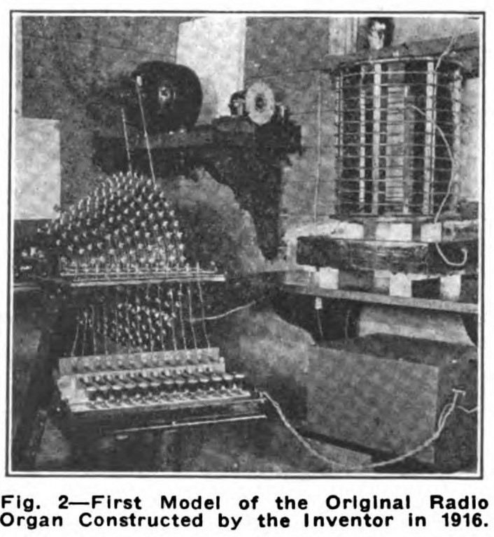

# 📡🧠 Wireless Organ

## Georges Désilets
Georges Désilets was born to farming parents in 1866 in Nicolet, Quebec. As a young adult he joined the
seminary. By the age of 27 in July of 1893 he was ordained into the ministry. As part of the work of his spiritual
vocation he began to teach astronomy, chemistry and physics at the seminary. Later he focused his instructional
efforts on music and natural history. Around this time it was very common for those in the clergy to be involved in
scientific and technological pursuits as hobbyists. Supported by a church or parish these men were often set up in
well appointed homes, had access to books, and the prime resource of any hobbyist: free time to tinker.

## First Version
The first version of the instrument had a short drum that delivered a
1 1/2 octave range, Désilets later attached a 4 octave touch
sensitive organ keyboard to a much longer spark-drum and attached
a foot controlled rheostat to allow expression control.
To produce higher and lower octaves (without the complexity
and scale of creating a longer spark-drum) the motor speed could
be varied to double or half the speed to deliver the required pitch
change. Semitones were achieved by a gearing mechanism:

“…semitones are obtained in the preferred form by a set of rows
exactly corresponding to the rows 27 30, 36, 40 and 45 traveling
at a rate -of speed 1/20 less than the rotor 1. For example, if the
rotor 1 is revolving at 500 r. p. m.,.the semitone rows must revolve
at 47 5 r. p. m. The different speeds of rotation may be obtained
by gearing”

The instrument was capable of playing polyphonically if the
input charge was boosted to allow multiple spark generation:

“…Obviously, in order to produce chords, it is only necessary to supply a current of sufficient intensity to permit
of a plurality of different sets of sparks at the same time consequent upon the pressure of the corresponding
number of keys.”

Désilets radio station was closed during the 19-14-18 war – the Canadian government closed all non-military
radio stations for security reasons –and his wave-organ silenced. When the station reopened, the invention and
popularity of the vacuum tube by Lee De Forest and others had made his spark-generating experiments obsolete.

## Next topic: Optophonic Piano

## Sources :
- Wikipedia / 120years.net / Sothismedias

## About the author:

"Guido F. Matis (a.k.a. widosub), a seasoned producer-composer authority with an unquenchable compassion towards the musical
expression, and many years of experience in the fields of event organizing, movie post-production, and recording with professional
musicians. His devotion to movie sounds shows in his art - widosub's music is filled with landscapes of emotions, dramatic twists and
melancholic moods. He's one of the hosts of Tilos Rádió's MustBeat show, in which he's is focusing on drum'n'bass and chillout
music. He's also one half of the duo Empty Universe."